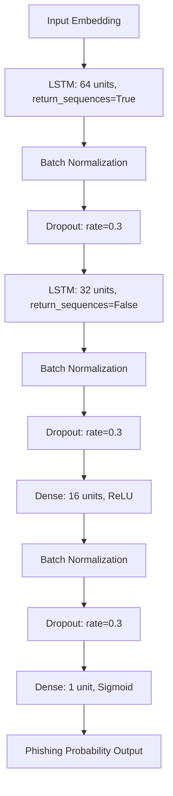

```mermaid
graph TD
    A["Input Embedding"] --> B["LSTM: 64 units, return_sequences=True"]
    B --> C["Batch Normalization"]
    C --> D["Dropout: rate=0.3"]
    D --> E["LSTM: 32 units, return_sequences=False"]
    E --> F["Batch Normalization"]
    F --> G["Dropout: rate=0.3"]
    G --> H["Dense: 16 units, ReLU"]
    H --> I["Batch Normalization"]
    I --> J["Dropout: rate=0.3"]
    J --> K["Dense: 1 unit, Sigmoid"]
    K --> L["Phishing Probability Output"]
```
